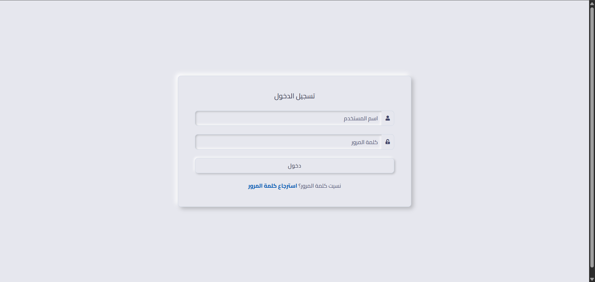
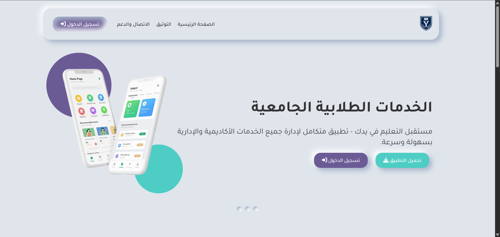
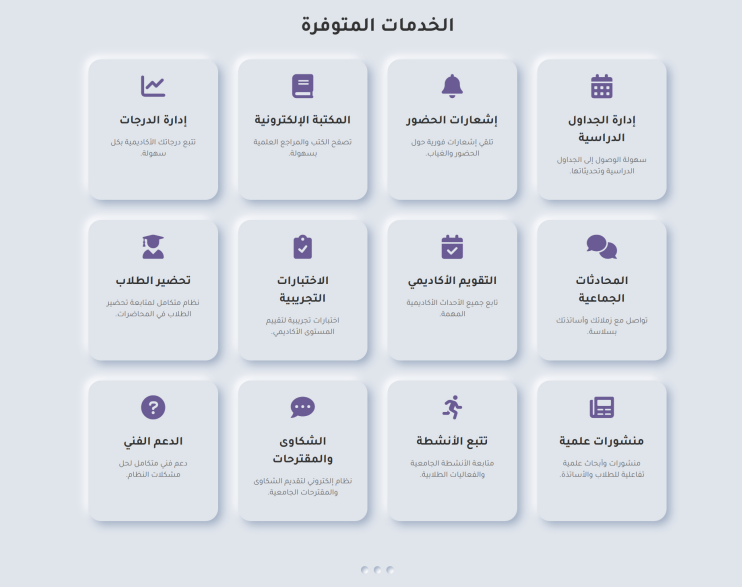
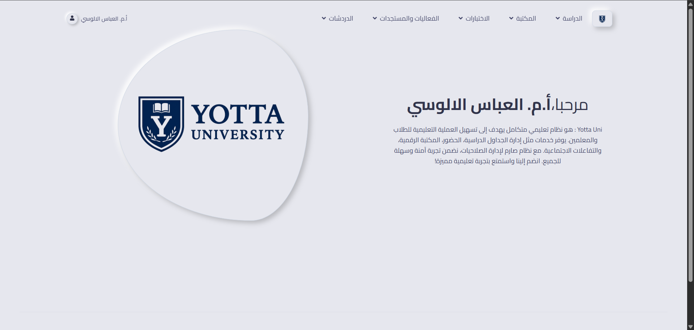
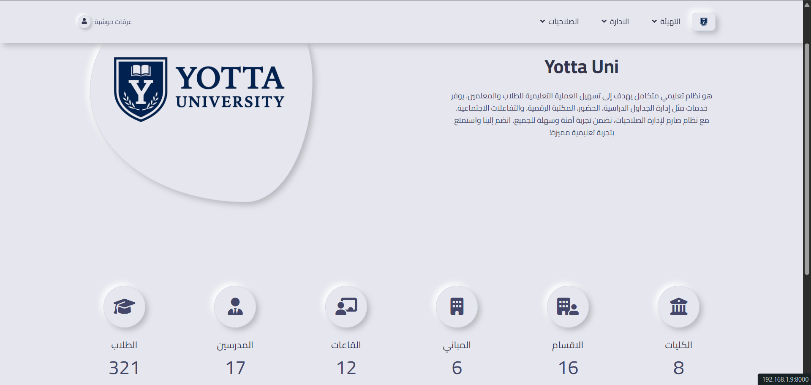
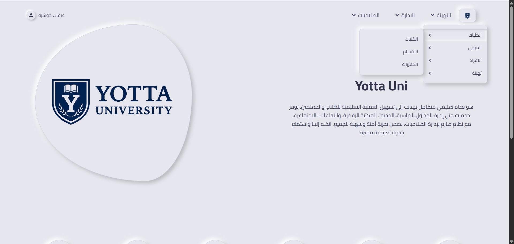
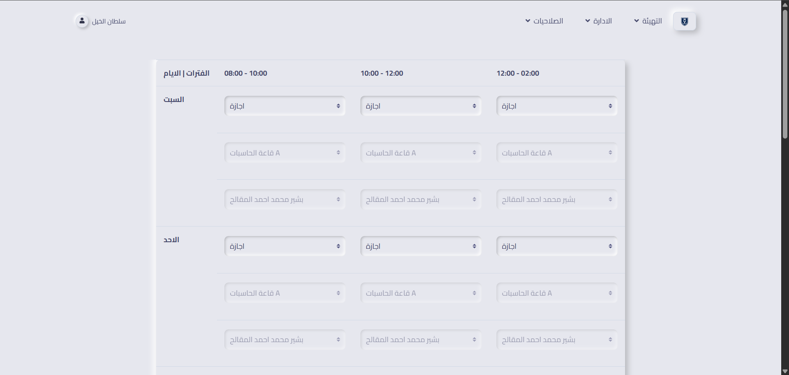
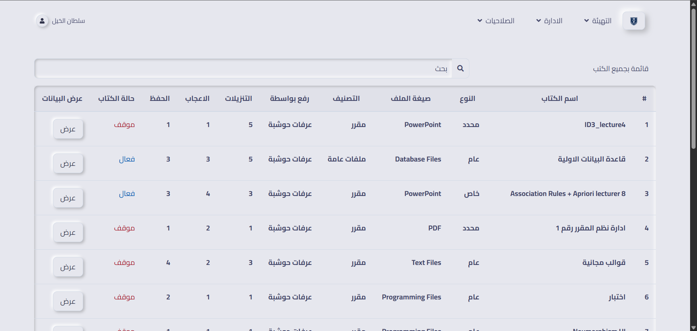
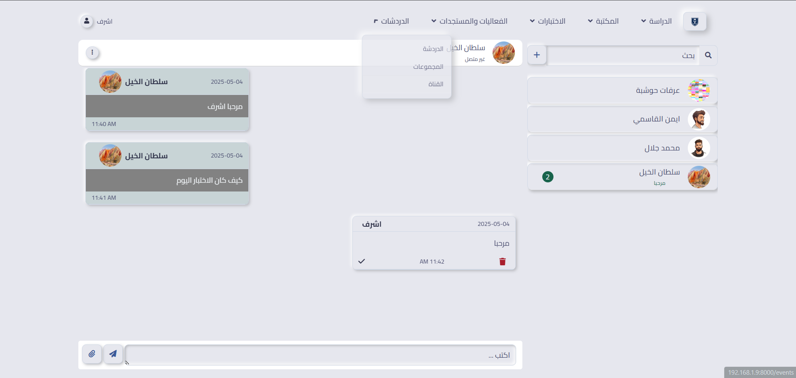
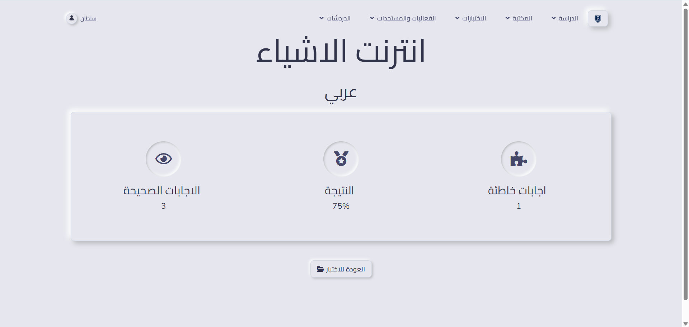

# 🎓 University Student Services Platform

A comprehensive university student services platform developed as a graduation project.
The system digitizes academic and administrative services for students, teachers, and university staff.

---

## 📌 Project Description

This platform was built to solve common problems in universities by providing a unified digital system that manages:

- Student academic records
- Attendance and schedules
- Exams and results
- University announcements
- Internal communication (chat & notifications)

The goal is to improve efficiency, transparency, and user experience in academic institutions.

---

## 🚀 Main Features

### 👨‍🎓 Student
- View academic profile
- Access schedules and attendance
- View exams and results
- Notifications and internal chat

### 👨‍🏫 Teacher
- Manage student attendance
- Publish grades and exams
- View schedules
- Notifications system

### 🛠️ Admin
- Full system control
- User roles & permissions
- Colleges, departments, courses management
- Academic years & schedules setup

---

## 🧰 Technologies Used

- **Backend:** Laravel
- **Database:** MySQL
- **Authentication:** Laravel Sanctum
- **Architecture:** RESTful API
- **Web Frontend:** Blade + CSS + JavaScript
- **Mobile App:** Flutter (separate repository)

---

## 🖼️ Screenshots

### 🔐 Login Page


### 🏠 Landing Page


### 📋 Available Services


### 👨‍🎓 Student Registration


### 👨‍🏫 Teacher Dashboard


### 🛠️ Admin Dashboard


### 🏫 University Setup


### 📅 Academic Schedule Setup


### 📚 Library Management


### 💬 Chat System


### 🧪 Exam Results


---

## ⚙️ Installation

```bash
git clone https://github.com/USERNAME/student-services-backend-laravel.git
cd student-services-backend-laravel
composer install
cp .env.example .env
php artisan key:generate
php artisan migrate
php artisan serve
